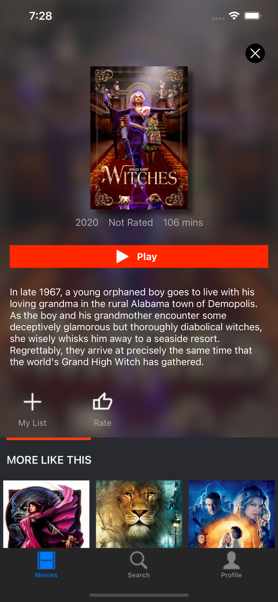

# Movie App 

Basic Movie using APIs from <a href="http://themoviedb.org/">themoviedb.org</a>

<ul>
    <li><a href="https://github.com/thethtun/movie-core-data/tree/feature/migrate-to-realm"> 
Using Realm
</li>
    <li><a href="https://github.com/thethtun/movie-core-data/tree/feature/mvp-refactor"> 
MVP architecture refactor
</li>
    <li><a href="https://github.com/thethtun/movie-core-data/tree/feature/viper-refactor"> 
VIPER architecture refactor
</li>
    <li><a href="https://github.com/thethtun/movie-core-data/tree/feature/redux-refactor"> 
Redux architecture refactor
</li>
</ul>

  
  

